# Design document List Tuner - Hendrik Scheeres

This document contains an overview of the design and features of the List Tuner web application

## Features

### Overview

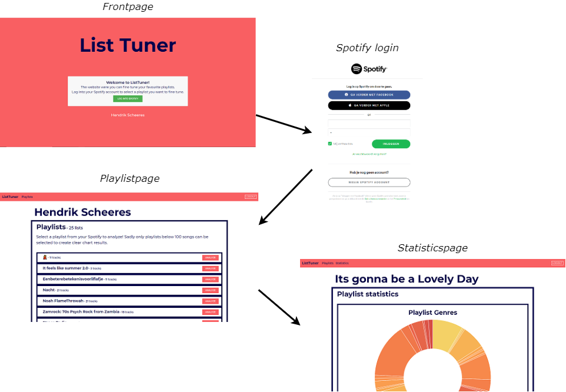

Above is an overview of the general functionality of the application. First a user gets linked to the Spotify login page from the Frontpage, were they can log into their own Spotify account. Once logged in they go to the playlist page with a list of they users Spotify playlist and the option to analyze a specific playlist. After selecting a playlist they get directed to the statistics page with different interactive charts of their playlist information.

### Frontpage

**pathway**: *"/"*

The frontpage contains a brief overview of the function of the web application and the *login button* that links the user to the Spotify login page. It does so by redirecting the user to the *"/login"* pathway that in turn redirects the user to the standard Spotify login page:

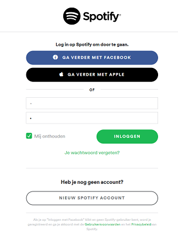

After being logged in the Spotify login page redirects to the *"/authorize"* pathway. This pathway saves the user token for later use with the Spotify API and finally redirects the user to the playlists page.

### Playlistspage

**pathway**: *"/playlists"*

The playlists displays the users username at the top of the page and below that a list of the users playlists. To get this information the Spotify API was used. The file *spotify.py* contains all the methods to request the information from the Spotify API and correctly format it. Subsequently it was also used on this page for the user and playlist info.

To select a specific playlist to analyze the user can click the analyze button that will redirect them to the statistics page:

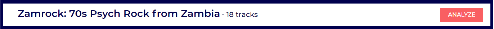

### Statisticspage

**pathway**: *"/statistics:<playlist_id>"*

The statisticspage contains all information about the playlist in a collection of different features.

#### Playlist charts

The chart data is retrieved through a server request from the *charts.js* file. From this file a POST request is send to the *"/statistics"* pathway. In this pathway the chart data is requested from the Spotify API and formatted through use of functions in *spotify.py* and eventually (if everything succeeded) gets send back to *charst.js* file.

While sending the requests and loading the data an loading animation is in the place of the charts.

After successfully receiving the chart data, the chart functions in *chart_functions.js* process the information and create the following interactive charts with the help of the [Chart.js](https://www.chartjs.org/) plugin.

**Genre chart**

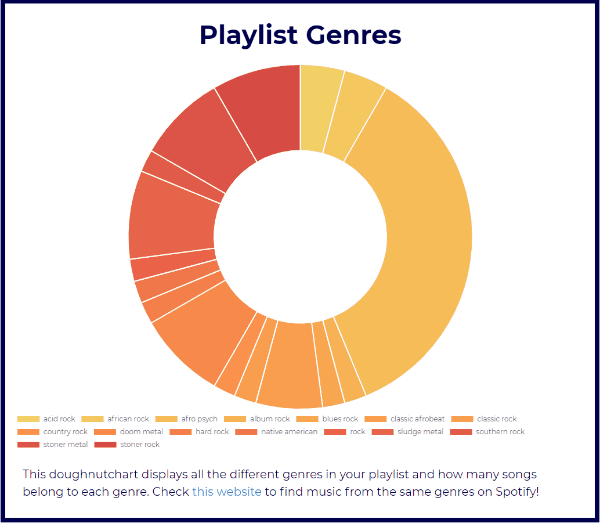

A doughnut chart displaying the different genres within the playlist. Beneath the playlist there is a link to a website where the user can easily browse through different music genres on Spotify. The chart also has an interactive legend, and hovering over data points with the cursor displays extra information.

**Tempo and Loudness chart**

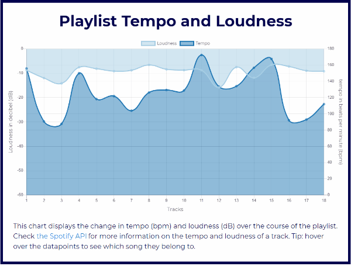

A line chart displaying the course of the tempo and loudness of the tracks through the playlist. Beneath the playlist there is a link to the Spotify API were the user can read up on the tempo and loudness of a track on Spotify. The chart also has an interactive legend, and hovering over data points with the cursor displays extra information.

**Track features chart**

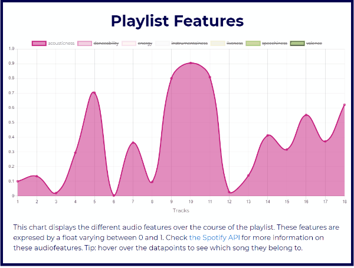

A line chart displaying the course of the track audiofeautures through the playlist. Beneath the playlist there is a link to the Spotify API were the user can read up on the audiofeatures of a track on Spotify. The chart also has an interactive legend, and hovering over data points with the cursor displays extra information.

**Average track features chart**

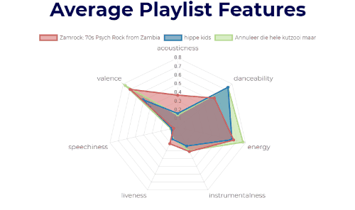

A radar chart displaying the average track audiofeautures of the users playlist and that of other playlist for comparison. The chart also has an interactive legend, and hovering over data points with the cursor displays extra information.

#### Tracks dropdown menu

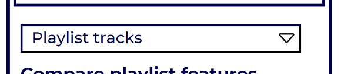

Tracks dropdown extended:

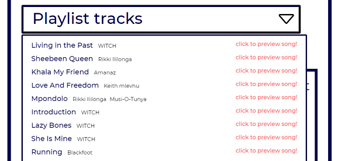

The statisticspage also features a dropdown menu with an oversight of all the tracks on the playlist. If it is possible to preview a track using the Spotify API, *"click to preview this song"* appears that enables the user to preview the song in a new tab.

#### Compare playlist features

This section of the statisticspage enables the user to compare their playlist to other playlists. The playlist information of these other playlists are saved in the *"Seals"* table in the database that is accessed with the *models.py* file. Once this information accessed the functions in *spotify.py* is used to retrieve and format the track information of these playlists. The track information gets send to the *chart.js* file through the *"/statistics"* pathway in a similar fashion to the users own playlist information.

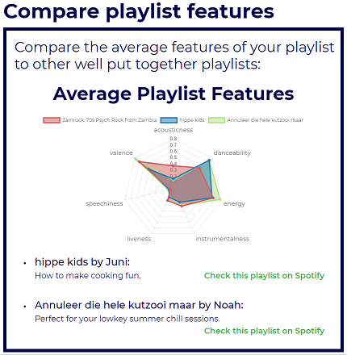

Below the chart is a list with the names and descriptions of the playlists the users playlist is compared to. Each playlist also has a link to the playlist on Spotify (*"Check this playlist on Spotify"*)

#### Extra buttons

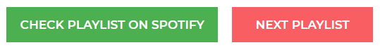

At the bottom of the statisticspage are two buttons. The *"CHECK PLAYLIST ON SPOTIFY"* button that links the user to the playlist the analyzed on Spotify and the *"NEXT PLAYLIST"* button that links the user back to the playlistpage to select a new playlist to analyze.

### General Features

#### Navigation bar

At the top of the playlists- and statisticspage is a navigationbar that enables the user to navigate through the website. The statisticspage link is only visible on the statisticspage itself. In the right corner is the logout button that redirects the user to the *"/logout"* pathway which removes the user information from the session and redirects the user back to the frontpage.
