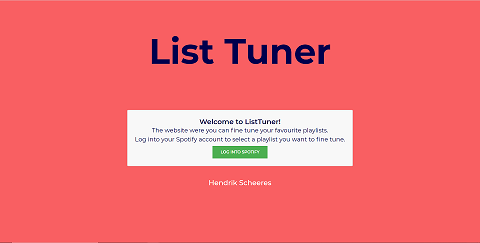
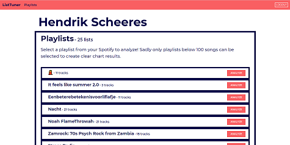
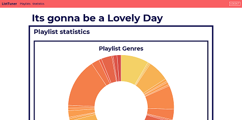

# List Tuner
**List Tuner** is a web application that shows you useful statistics of your music playlists on Spotify so that you can fine tune them to perfection. Made as a final project during the Minor Programming Course in 2020.

## Getting started

### Installation

This application was made using the Flask web application framework. Install all the required packages to run the website by running:

        $ pip3 install -r requirements.txt

### Running the application

Run *run.sh* to start up the web application:

        $ ./run.sh

### Examples

*Playlist page & Statistics page*

For a detailed example of List Tuner and its features, see the screencast below:

[Screencast (Dutch)](https://www.youtube.com/watch?v=gGwmj3Tg4Ao)

### Structure

- **application.py** - *main application file*
- **spotify.py** - *API handler functions*
- **models.py** - *database structure*
- **run.sh** - *bash script with environment variables*
- **requirements.txt** - *required packages*
- **templates** - *HTML templates*
- **static**
  - **scripts** - *JS scripts*
  - **styles** - *SCSS stylesheets*
- **app**
- **flask_sessions** - *user sessions*
- **migrations** - *database migration files*
- **README.md**
- **DESIGN.md** - *overview of the application features*
- **PROCESS.md** - *process book of building the application*
- **REVIEW.md** - *code review*
- **ASSESSMENT.md** - *project assessment*

## Built with

- [Flask](https://flask.palletsprojects.com/en/1.1.x/) - *web framework*
  - Flask-Session
  - [Flask-Migrate](https://flask-migrate.readthedocs.io/en/latest/) - *database migrations*

### Data sources

- [Spotify Web API](https://developer.spotify.com/documentation/web-api/)
- [Heroku](https://dashboard.heroku.com/) - *host of PostgresSQL database*

### External components

- [Authlib](https://docs.authlib.org/en/latest/) - *API Authentication*
- [Alembic](https://alembic.sqlalchemy.org/en/latest/) - *manages database migrations*
- [SQLAlchemy](https://www.sqlalchemy.org/) - *database toolkit*
- [Bootstrap](https://getbootstrap.com/) - *application design*
- [Chart.js](https://www.chartjs.org/) - *data visualization*
  - [Colorschemes](https://www.npmjs.com/package/chartjs-plugin-colorschemes)
- [Requests](https://requests.readthedocs.io/en/master/) - *API requests*

## Author

- **Hendrik Scheeres** - Minor Programeren UvA 11228962 2020

## Acknowledgments
